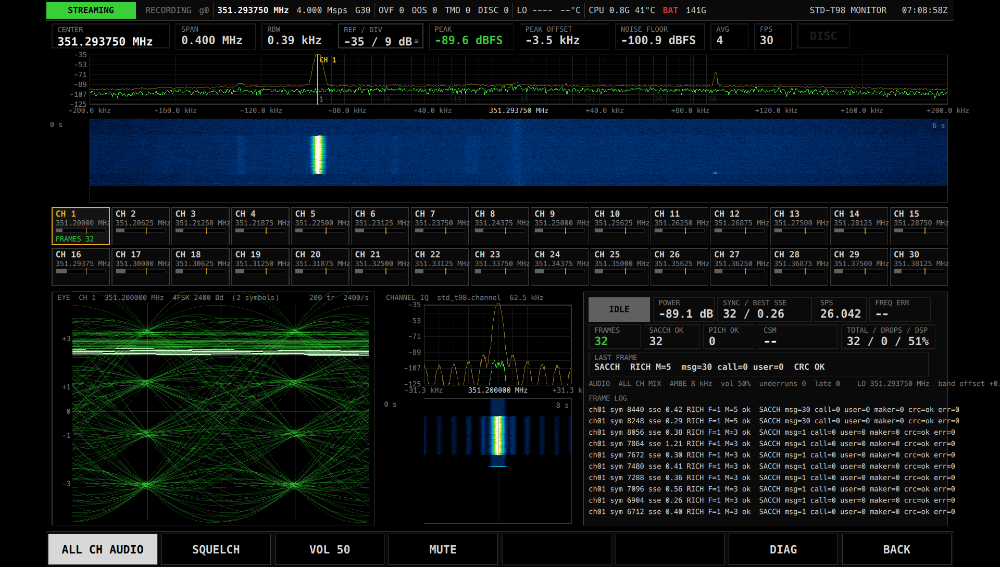

# S.P.E.A.R.

**Signal Processing & Emission Analysis Receiver**

タッチ操作の専用 RF 計測器として動く、SDR 信号処理の基盤。
「動いている DSP に、あとから観測点を足せる」ことを中心に設計されている。

*S.P.E.A.R. is a platform for building touch-operated RF instruments on a rugged tablet (Panasonic FZ-G2)
and a USRP B210. Its core idea: any intermediate signal in a running DSP chain can be observed, branched,
and recorded without touching the DSP itself — and nothing is ever lost silently. C++20 / Qt 6 / UHD, GPL-3.0.*


## 出発点

無線の受信ツールを作っていて、いつも同じところで詰まる。復調が動き始めたあとで
「ここの波形を見たい」「この段のアイパターンを出したい」となると、DSP を別プロセスで組み直すか、
コードの中に表示用の分岐を書き足すしかない。観測のたびに信号処理そのものを歪めることになる。

S.P.E.A.R. は、この一点を解決するために作った。

> **後からウォーターフォールやアイパターンを、既存の DSP コードに一切触れずに追加できるか。**

以降の設計はすべてこの問いに従う。中心にあるのは、プロセスでも GNU Radio のブロックでも通信方式でもなく、
**型と時間情報を持ち、どこからでも観測・分岐・記録できる Signal Stream** である。

## 三つの原則

**1. producer は consumer を知らない。**
DSP の各段は結果を stream として publish するだけで、誰が受け取るかを知らない。
観測点(スペクトラム、ウォーターフォール、アイパターン)は Stream Bus に consumer を 1 本足すだけで付き、
DSP の構造は変わらない。表示側が遅くても信号処理は止まらない。

**2. 無言の欠落は存在しない。**
consumer ごとに配送方針を宣言する。損失が許されない consumer(復号、録音)は溢れたら必ず事象と不連続フラグで表面化し、
表示用の consumer は最新だけを受け取って捨てた数を数える。装置側の overflow(ホストの読み遅れ)と
out_of_sequence(USB での欠落)も区別したまま残す。「取りこぼしたら必ずそう言う」ことが計測器とアプリケーションの差である。

**3. 結果は元のサンプルまで遡れる。**
すべてのサンプルブロックが装置のサンプル番号を持ち、すべての事象(フレーム検出、キャリア検出、retune …)が
「どのサンプル範囲から生じたか」を持つ。DSP の各段が rate と群遅延を宣言するので、復号結果から元の IQ を機械的に切り出せる。

これを支えるために、配線はビルド時に固定し、動作する App は常に 1 つ、Core・App・GUI は単一プロセスで動かす。
単一プロセスなのは性能のためではなく、任意の中間点にコピーもソケットもなしに consumer を足せるようにするためである。

## 装置として

参照モデルは PortaPack(電源投入 → メニュー → App を選ぶ → 実行 → 戻る)。
Linux 上の SDR アプリケーションではなく、Linux を内部実装として使う計測器として作っている。

- **タッチだけで使える。** キーボードもマウスも OS の仮想キーボードも前提にしない。数値入力・キーパッド・ステップキーは自前。
- **計器の文法。** 黒基調・フラット・高コントラスト・等幅数値。色は意味(正常 / 注意 / 異常 / 待機)にだけ使う。
- **装置の状態は推定しない。** USRP の状態は libusb の列挙・FX3 のレジスタ・センサ・UHD 自身のログという一次ソースから判定し、
  根拠つきで画面左上に常に表示する。起動時の自己診断、USB 切断からの自動復帰、時刻付き retune を Core が引き受ける。

## 構成

```
  USRP B210 ──► Radio(UHD の唯一の所有者)
                  │
                  ▼
              Stream Bus  radio.rx ─┬─► Lossless   ─► 録音 / 復号
                                    └─► LatestOnly ─► 表示
                  │  Event(来歴つき)/ TAP / Health / Audio
                  ▼
              App SDK(GuiApp、観測点、TraceSource、ビルド時レジストリ)
                  │
   ┌──────────────┼───────────────┬──────────────────┐
 SPECTRUM    IQ RECORDER      FM / AM RX     STD-T98 MONITOR   … 任意の App
```

| 層 | ディレクトリ | 役割 |
|---|---|---|
| Core | `core/` | Radio、Stream Bus、Block pool、Source(B210 / SigMF 録音 / 合成)、Event、Health、TAP、AudioSink |
| 共通 DSP | `dsp/` | 数学的に定義され用途の定数を含まない原始演算だけ(FIR 設計、間引き / 補間、PFB channelizer、スペクトラム推定、段の規約) |
| App SDK | `appfw/` | `GuiApp` 基底、レジストリ、任意の stream に付く観測点、アイパターン用トレース |
| 部品 | `widgets/ input/ theme/` | 計器の表示部品、自前のタッチ入力、デザイントークン |
| シェル | `gui/` | メニュー / ステータスバー / ソフトキー / 診断画面 / 数値入力 |
| App | `apps/` | 1 ディレクトリ = 1 App。`spear_add_app()` を 1 回呼べば登録される。学習済みモデル(STD-T98 秘話)も App の下に置き、バイナリに埋め込む |
| ツール | `tools/` | ヘッドレス実行、録音の解析、耐久試験 |

Source が B210 でも録音でも合成信号でも App のコードは同じなので、実機で録った IQ を同じ DSP に流し直せる。
受信系の回帰テストは合成信号ではなく実録音の抜粋を真値にしている。

## App

App は基盤の上に載る利用者であり、同時に基盤を検証する手段でもある。App を 1 本書くたびに、
足りなかった API や部品を `docs/apps/<id>.md` に記録して基盤へ反映する。

| App | 内容 | 基盤のどこを確かめたか |
|---|---|---|
| **SPECTRUM** | スペクトラム + ウォーターフォール、タッチ選局 | SDK の最小形、既知周波数の実信号での軸と絶対値 |
| **IQ RECORDER** | 損失なし SigMF 録音(sidecar に世代 / 不連続 / retune 履歴) | Lossless 不変条件の画面化、録音の再生 |
| **FM / AM RX** | NFM / WFM / AM 復調、ゼロ IF の DC を避ける LO 分離、音声出力 | 共通 DSP の境界、段の規約と来歴、観測点の後付け |
| **STD-T98 MONITOR** | ARIB STD-T98(デジタル簡易無線)30 チャネル同時受信・復号・AMBE 音声・秘話の鍵探索 | Qt / UHD 非依存の受信機のヘッドレス検証、実録音の真値、実機での引き込み、学習済みモデルの C++ / ONNX 推論をワーカースレッドで |

<table><tr>
<td></td>
<td></td>
</tr><tr>
<td></td>
<td></td>
</tr></table>

新しい App は `apps/template/` を写して始める。契約とチェックリストは [`docs/app-development.md`](docs/app-development.md)。

## 動かす

対象は Panasonic FZ-G2(1920×1200、タブレットモード)+ Ettus USRP B210(互換機を含む、USB 2.0 可)。
他の PC や SDR への移植性は要件にしていない。

- Arch Linux、GCC 13+、CMake、Ninja、Qt 6.6+、FFTW、GoogleTest、ALSA / PipeWire、ONNX Runtime(`onnxruntime-cpu`、STD-T98 秘話)
- **パッチ済み libuhd**([`packaging/libuhd`](packaging/libuhd/README.md))。素の UHD 4.9 は USB 切断後に `std::terminate` するため、
  再接続にはパッチを当てたパッケージが要る。公式と同じ構成でビルドし、他の UHD アプリと共存する。

```
cmake -S . -B build -G Ninja && ninja -C build     # ビルド
ctest --test-dir build -j4                         # テスト(ハードウェア不要)
./spear.sh                                         # 実機で全画面起動
./spear.sh --source synthetic                      # ハードウェアなし
./spear.sh --source file:<sigmf base>              # 録音を再生
```

個体・現場固有の値(その B210 の LO 誤差など)は `~/spear/site.conf` に置き、コードには入れない。
運用の詳細は [`docs/tools.md`](docs/tools.md)。

## ドキュメント

| | |
|---|---|
| [`docs/requirements.md`](docs/requirements.md) | 要件定義。設計の根拠がすべてここにある(§番号で参照される) |
| [`docs/DEVELOPMENT.md`](docs/DEVELOPMENT.md) | 開発の入口 — 読む順、守る規約、確かめ方 |
| [`docs/STATUS.md`](docs/STATUS.md) | 現状 — 検証済みの事実、未完の仕事、決定の記録 |
| [`docs/app-development.md`](docs/app-development.md) | App を足す(SDK の契約とチェックリスト) |
| [`docs/state-ownership.md`](docs/state-ownership.md) / [`docs/dsp-boundary.md`](docs/dsp-boundary.md) / [`docs/gui/DESIGN.md`](docs/gui/DESIGN.md) | 規約 — 状態の単一所有 / 共通 DSP の境界 / UI の設計 |
| [`docs/diagnostics.md`](docs/diagnostics.md) / [`docs/tools.md`](docs/tools.md) | 装置の診断 / 起動・録音解析・耐久試験 |
| [`docs/apps/`](docs/apps/) | 各 App の欠陥レポート |

## ライセンス

GPL-3.0-or-later([`LICENSE`](LICENSE))。
`apps/std_t98/ambe/` は mbelib / mbelib-neo 由来の GPL-2.0-or-later(各ファイルの SPDX と著作権表示を参照)。
`packaging/libuhd` のパッチは UHD(GPL-3.0-or-later)への変更。
