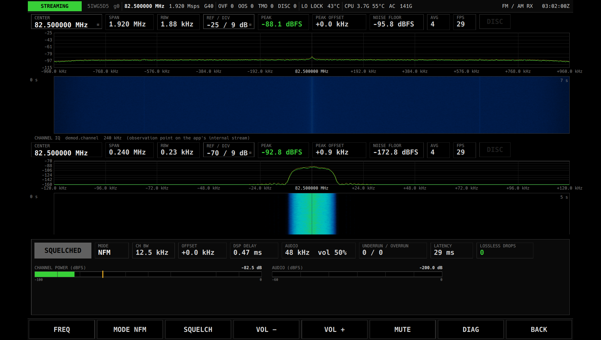

# FM / AM RX — 欠陥レポート(2026-09-17、dogfooding)

**検証対象**: DSP 境界の線引き、段の規約 + Provenance、§0(DSP に触れず観測点を足す)、AudioSink。

## DSP 境界の判定結果
| 部品 | 置き場 | 理由 |
|---|---|---|
| `design_lowpass`(窓関数法 FIR 設計) | 共通 `dsp/fir.hpp` | 数学定義、全 App が使う、参照ベクトルで検証可 |
| `FirDecimator<cf32/float>` | 共通 | 性能要衝(§1.1)。段の規約(`StageInfo`)を実装 |
| `QuadDemod`(x·conj(x[n−1]) の偏角)| **App 内** | 数学定義だが、まだ使う App が 1 つ。STD-T98(4FSK)で 2 つ目 → 抽出候補 |
| `OnePole`(de-emphasis / DC block)| App 内 | 同上。ADS-B / STD-T98 の DC block で 2 つ目 |
| mode 定数(チャネル幅、de-emphasis 50 µs、偏移 2.5/75 kHz)| App 内 | 用途の定数。共通に置いてはならない |
| squelch | App 内 | 判定閾値は用途依存 |

結論: **共通の原始演算(FIR 設計 / decimator)+ App の定数だけで FM/AM が書けた**。線引きは成立。
足りなかった共通部品: 有理数リサンプラ(48 kHz へ整数比で落とせる 1.92 Msps を App が宣言して回避。B210 以外の rate では必要になる)。

## §0 の検証
App 内部の channel IQ(240 kHz, cf32)と audio(48 kHz, float)を **Stream Bus の stream として publish** し、
`ViewProcessor` を `demod.channel` に接続してチャネルフィルタの形をリアルタイムに観測できた。DSP コードには触れていない。
そのために `ViewProcessor` を `StreamBase&`(sc16 / cf32)に一般化し、`SpectrumEstimator` に cf32 の平均版を足した。

## Provenance
`dsp::Provenance` を段の `StageInfo` から合成し、搬送波検出 event の範囲を radio.rx の sample index に逆算。
群遅延合計 0.47 ms(1.92 Msps 基準)を画面に表示。手計算(§4.5)を規約で置き換えられた。

## 見つかったプラットフォームの欠陥
1. **FFTW のプランナがスレッド安全でない**。観測点を 2 つ同時に作ると `fftwf_plan_dft_1d` が並走してヒープ破壊 → SIGSEGV。
   `SpectrumEstimator` の plan 生成/破棄を mutex で直列化して修正。「観測点を後付けする」設計が初めて 2 本同時に走った瞬間の発見。
2. 自動レンジがフィルタ済み stream で破綻(阻止域の床 −173 dB を基準にして通過帯域が白飛び)→ ピーク基準の下限を加味。
3. 小さい SpectrumView で dB 目盛が重なる → 高さで間引き。
4. `on_start` の GUI thread 保証(SDK 移植時に発見済み)がここでも効いた: AudioSink / timer を普通に使えた。

## 実機結果(2026-09-17)
B210、82.5 MHz(アンテナなし)、NFM: 両観測点 29 fps、音声 48 kHz open、underrun 0、遅延 34 ms、Lossless drop 0。
off-air の FM 実信号テストは 422.2 MHz の特定小電力トランシーバーで行う(AM の実信号は手段なし。合成 AM テストのみ)。

## 選局と LO の分離(2026-09-17、off-air 確認後の指摘)
ゼロ IF の DC スパイク / LO 漏れは原理的なので、復調チャネルを LO に置かない。**RX FREQ**(利用者が選ぶ値)と
**LO OFFSET**(App の State、既定 +250 kHz)を分け、LO = RX − offset を Core に要求し、mixer で戻す。
RX 周波数は `sys.centerFreq + app.channelOffsetHz` の導出値でコピーを持たない。wide view に RX マーカーを表示。
テストは合成 FM を +250 kHz に置いて LO 分離状態で復調することを確認。

**off-air**: 422.2 MHz の特定小電力トランシーバーを NFM で正常に復調。

## 残課題
* ソフトキー 7 個の予算が尽きた(DIAG を落とした)。シェル側に「MORE」で 2 面目を持つ仕組みが要る(プラットフォーム課題)
* 選局(チャネルオフセット)をスペクトラム上のタップで指定する操作(Widget 側の hit → App の `channelOffsetHz`)
* 有理数リサンプラ(共通候補)、AGC(AM 用。時定数は引数)
* 音声のオシロ表示(Widget library の Oscilloscope。`demod.audio` stream に接続するだけ)
