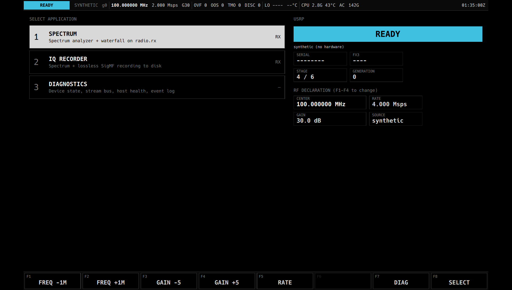
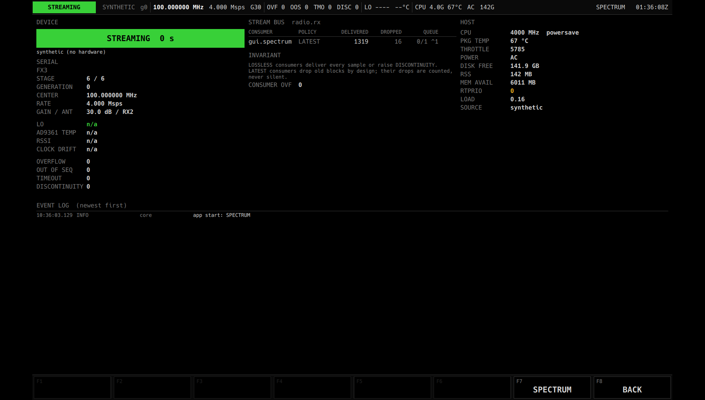
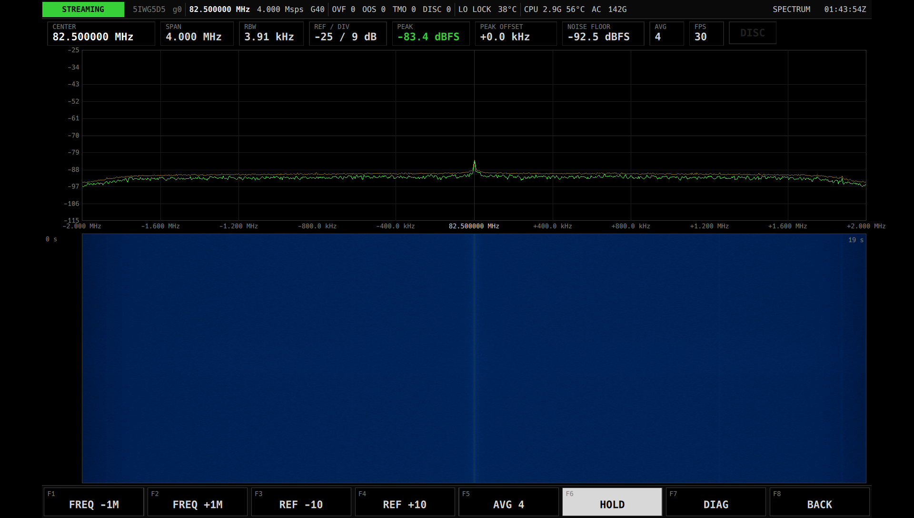
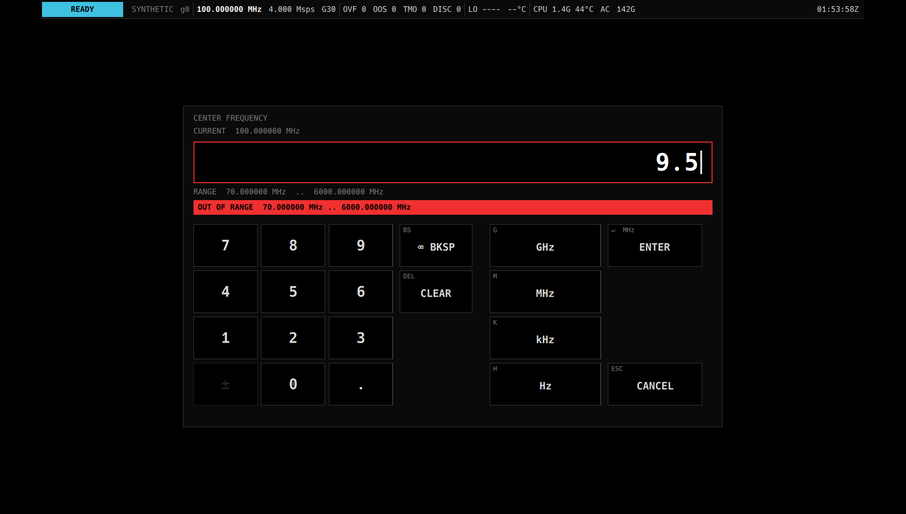

# GUI 設計ノート (要件 §9)

## 方針
古い産業用機器・発電所 LCD・航空機グラスコックピット / TSD・デジタルオシロの文法。
視認性と状況認識が最優先。**黒基調・フラット・高コントラスト・等幅数値・グリッド**。
グラデーション・透過(グラス)・角丸・影・発光エフェクトは使わない。低予算 SF 的な装飾もしない。
色は「意味」にのみ使う: 緑 = 正常/受信中/確定、琥珀 = 注意/遷移中、赤 = 異常、水色 = 待機/補助、灰 = 不在。
キーは白枠のフラットが基本で、色を持つのは確定キー(数値入力の ENTER = 緑、`KeyButton.accent`)だけ。
装置状態は常に画面左上に塗りつぶしで表示し、文字は黒(最も目に入る要素にする)。

## 構成
```
┌ StatusBar (44 px): [STATE] serial gen | freq rate gain | OVF OOS TMO DISC | LO temp | CPU temp AC disk | app  clock ┐
│ Page: MenuPage / SpectrumPage / DiagnosticsPage                                                                 │
└ SoftKeyBar (76 px): 8 個のソフトキー(文脈依存)                                                                   ┘
```
1920×1200 の固定キャンバスを物理 px で設計し、窓がそれと異なる場合は等倍縮尺で収める(専用機では 1:1)。
**操作はタッチのみ**(FZ-G2 タブレットモード専用)。キーボード・マウスは考慮せず、カーソル・フォーカス・
ショートカット表記のような「キーボードがある前提」の要素は持たない。押下の手応えは押している間の反転だけ。

## 実装
* `ViewProcessor`: Stream Bus の LatestOnly consumer(自前 thread)。FFT → spectrum frame / waterfall 行(RGBA)。
  GUI が遅ければ自分の stream が drop するだけ(§10)。
* `SpectrumItem`: `QSGGeometryNode` の line strip(live + max hold)。グリッド・目盛は QML。
* `WaterfallItem`: 自前 `QSGTexture`(`QRhiTexture`)。行単位の部分アップロード + リング状テクスチャ座標で
  スクロール(memmove もフル再アップロードも無し, §9.4)。
* `SystemModel`: DeviceState / evidence / センサ / rx 統計 / consumer 統計 / host / event log を 250 ms で QML へ。
* `Shell`: App 一覧・選択・実行・戻る。`Core::run_app` は装置適用を待つので worker thread で呼ぶ。
  RF の草案は GAIN(AGC 可)だけをメニューで編集し、center / rate は各 App が決める(汎用 App は FREQ / RATE キー、
  rate 変更は `Shell::restartActiveWithRate()` で App を再起動)。App 停止時に草案は Core の実 RF に追従する。
* `TraceSource` / `EyeDiagramItem`: App の DSP が切り出した固定長トレース(アイパターン)を任意スレッドから push、
  `DrawLines` で重ね描き(古いトレースは薄く、直近は明るく)。目盛・判定点は `EyeDiagram.qml`。
* `SpectrumView` の `markers`(多チャネルのマーカー列)と `compact`(読み出し行なし・軸ラベル間引き)。
* AGC 表示: 数値は残し白線の X + 中央の白箱に黒字 `AGC`(「AGC が gain をオーバーライドしている」が読める)。
* DIAG のイベント行は 1 行固定(複数行の detail は ` | ` で畳む)。

## 検証
`spear-gui --screenshot out.png --after N [--start-app I] [--diag] [--open-entry] [--app-action key] [--restart-rate R] [--agc]`
で実画面をキャプチャして目視確認する(`--source file:<base>` で録音を流せば実信号の画面が撮れる)。

| | |
|---|---|
|  |  |
|  | |

## 入力部品 `Spear.Input`(自前実装、Qt Virtual Keyboard / Quick Controls 非依存)

OS やデスクトップの仮想キーボードは信用しない。すべての入力は自前の QML 部品によるタッチ操作。
他 App から再利用するため独立モジュールにしてある(`Spear.Theme` を共有)。

| 部品 | 役割 |
|---|---|
| `KeyButton` | フラットなキー。押下で反転、長押しリピート、`press()` で物理キーからも同じ経路 |
| `Keypad` | キー配列を model(`[{label, action, span, sublabel, enabled, active, repeat}]`)で与える汎用グリッド。テンキー・単位キー・将来の英数キーボードの土台 |
| `NumericEntry` | モーダルの数値入力。計測器の文法(数字 → 単位キーで確定)、範囲検証(閉じずに赤で理由) |
| `ValueField` | タップで入力を開く読み出し欄(編集可能の目印付き) |
| `StepKeys` | −/+ ステップ(長押しリピート) |

使い方: `NumericEntry { id: e; title; minimum; maximum; units: [{label, factor}]; displayFactor; displayUnit; onAccepted: (v) => ... }` → `e.open(current)`。
Main.qml の `askFreq / askRate / askGain / askRef` が典型例。入力中もステータスバーは見える。



## 検証メモ
この開発機では Qt のログ(QML の警告・console.log)が journald へ行く。`QT_FORCE_STDERR_LOGGING=1` を付けて実行すること。
